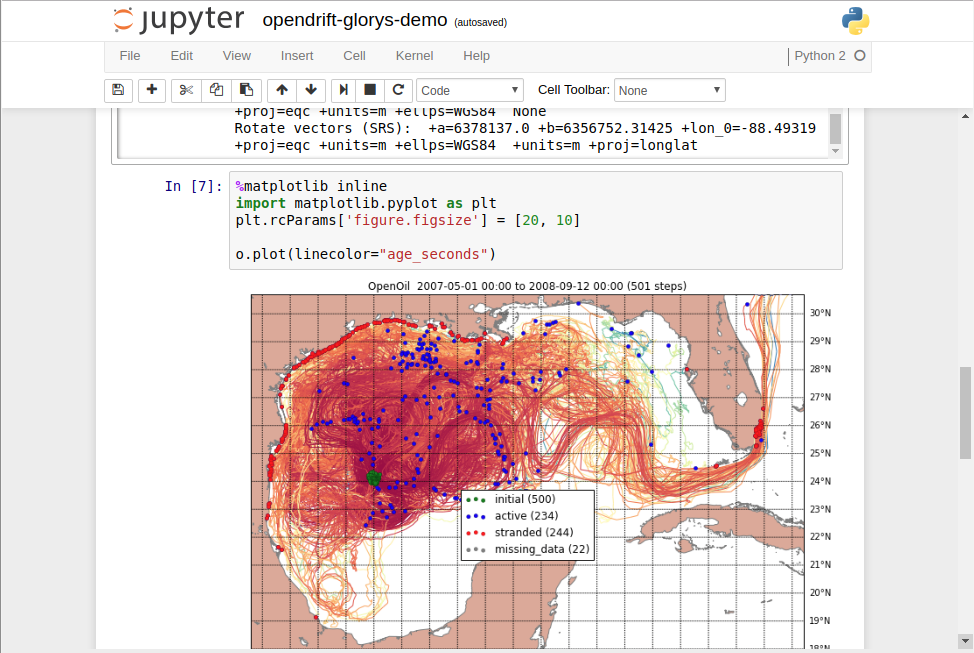
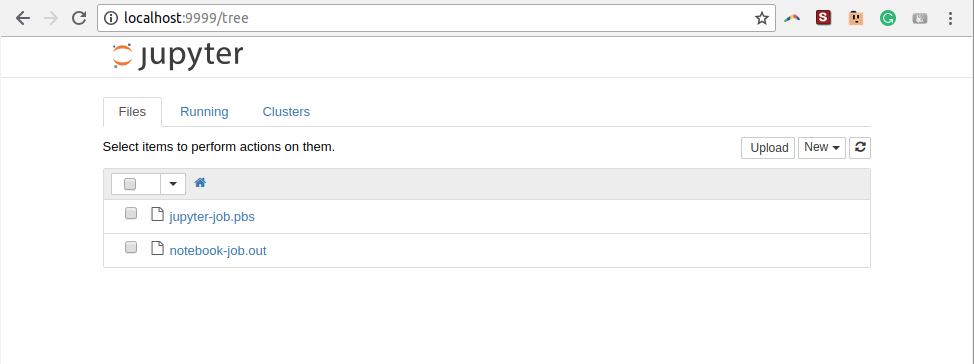

.. _job-examples:

Tareas de ejemplo
=================

Hola mundo
----------

El siguiente script reserva un nodo de computo por un tiempo maximo de 1 minuto. 
El script imprime en la consola estandar "Hola Mundo" duerme 10 segundos y termina imprimiendo la fecha y hora.

.. code-block:: bash
    
    #!/bin/sh

    # Directivas
    #PBS -N HolaMundo
    #PBS -l nodes=1,walltime=00:01:00

    # Definir los archivos de salida de consola y de error
    #PBS -o holamundo.out
    #PBS -e holamundo.err

    # La variable de entorno $PBS_O_WORKDIR es el directorio desde el que se ejecuta "qsub holamundo.sh"
    cd $PBS_O_WORKDIR

    # Imprimir "Hola mundo"
    echo "Hola Mundo"

    # Dormir por 10 segundos
    sleep 10

    # Imprimir la fecha y hora
    date

    # Fin del script

Python
-------

Programas en python pueden ser enviados como tareas por lotes al cluster. 

Como ejemplo el siguiente codigo en python. ``interpol1D.py``

.. code-block:: python

	import numpy as np
	import matplotlib 
	matplotlib.use('Agg')	
	import matplotlib.pyplot as plt
	from scipy import interpolate

	x = np.linspace(0, 10, num=10, endpoint=True)
	y = np.cos(-x**2/9.0)

	f = interpolate.interp1d(x, y)

	f2 = interpolate.interp1d(x, y, kind='cubic')

	xnew = np.linspace(0, 10, num=200, endpoint=True)

	tck = interpolate.splrep(x, y, s=0)
	f3 = interpolate.splev(xnew, tck , der=0)

	plt.plot(x, y, 'o', xnew, f(xnew), '-', xnew, f2(xnew), '--', xnew, f3)
	plt.title('Intepolacion 1D - metodos')
	plt.legend(['data', 'linear', 'cubic','Cubic Spline'], loc='best')
	plt.savefig('interpol1D.png', dpi=250, format='png')

Preparamos el script para enviar la tarea al manejador de recursos:

.. code-block:: bash

	#!/bin/bash
	#PBS -N pythonjob
	#PBS -q default
	#PBS -l nodes=1
	#PBS -j oe

	module load anaconda-python-2.7

	set -x
	cd $PBS_O_WORKDIR

	echo Inicio: `date` > tiempo.log
	start=`date +%s`

	python interpol1D.py

	echo Final : `date` >> tiempo.log
	end=`date +%s`
	echo Tiempo ejecución : $((end-start)) seg. >> tiempo.log

Para ejecutar la tarea escribimos:

.. code-block:: shell

	$ qsub submitjob.sh

El resultado de la operación correcta de esta tarea debe producir tres archivos, una imagen png ``interpol1D.png`` un archivo ``tiempo.log`` y ``submitjob.o####`` siendo #### el numero del JobID que nos asigno el manejador de tareas.

Jupyter Notebook
-----------------

Jupyter notebook es una aplicación web desarrollada en python, que permite crear y compartir documentos que contienen código vivo, ecuaciones, visualizaciones y texto narrativo, sus usos incluyen el analisis de datos, estadística, y visualización, entre otras cosas. Jupyter notebook soporta más de 40 lenguajes de programación, entre ellos Python, Julia, R, incluso Matlab. 

Con esta aplicación podemos ejecutar comandos de Python, o Julia (2 Kernels disponibles en chaman) desde una interface web. Estos comandos se ejecutan en los recursos reservados de chaman, y se reciben los resultados numericos o graficos, embebidos en la misma interface web.

.. note::

	Jupyter notebook esta disponible en los modulos ``anaconda-python-2.7`` y ``anaconda-python-3.5``.

Para ejecutar esta aplicación es necesario seguir los siguientes pasos:

Copiar el siguiente script a un archivo `notebook-job.pbs`:

.. code-block:: shell 
	:linenos:

	#!/bin/sh

	# Directivas
	#PBS -N notebook-job
	#PBS -l nodes=1,walltime=01:00:00

	# Definir los archivos de salida de consola y de error
	#PBS -o notebook-job.out
	#PBS -j oe

	cd $PBS_O_WORKDIR

	module load anaconda-python-2.7

	JUPYTERPORT=9999	
	echo "ssh -N -L $JUPYTERPORT:$(hostname):$JUPYTERPORT $USER@chaman.cicese.mx"	
	jupyter notebook --no-browser --ip=$(hostname) --port=$JUPYTERPORT --NotebookApp.token=''

Reservar recursos:

.. code-block:: shell

	$ qsub notebook-job.pbs

Si hay recursos disponibles en el cluster, el script generara un archivo de bitacora ``notebook-job.out``, en la primera linea de este archivo estara un comando de ssh que necesitamos ejecutar en nuestro equipo local (PC, Laptop). El comando será algo como lo siguiente:

.. code-block:: shell	

	ssh -N -L 9999:compute-local-0-28:9999 miusuario@chaman.cicese.mx

Copiar este comando y ejecutarlo en el equipo local, ssh preguntara por su contraseña de acceso a chaman. Una vez escrita podemos navegar desde nuestro explorador (firefox, chrome) a ``http://localhost:9999`` donde estara la interface web de jupyter notebook.

.. important:: 

	Una vez terminada la sesión de Jupyter Notebook, no olvidemos terminar la tarea que se mando al cluster y el comando de ssh que se ejecuto en el equipo local.

.. code-block:: shell

	[miusuario@chaman my-notebook]$ qstat
	Job ID                    Name             User            Time Use S Queue
	------------------------- ---------------- --------------- -------- - -----
	29521                      GOLFO36-TRA10    user1          256:41:0 R memsup         
	29522                      GOLFO12-R29      user2          80:35:40 R default        
	29530                      notebook-job     miusuario      00:07:05 R default   * 
	
	[miusuario@chaman my-notebook]$ qdel 29530 

.. code-block:: shell

	[miusuario@mi-maquina ]$ ssh -N -L 9999:compute-0-2.local:9999 miusuario@chaman.cicese.mx
	Password: *****

	^C (ctrl + C)

Solución de problemas
^^^^^^^^^^^^^^^^^^^^^

Si en el archivo ``notebook-job.out`` se encuentra algun mensaje como el siguiente: 

.. code-block:: shell

	ERROR: the notebook server could not be started because no available port could be found.

Probar cambiando la variable ``JUPYTERPORT`` en el script al numero anterior. Ej. ``JUPYTERPORT=9998``

Esto puede ser necesario pues si el puerto que se especifique en ``JUPYTERPORT`` debe de estar disponible. Es decir que ninguna otra aplicación este utilizando el mismo puerto, tanto en los recursos reservados de chaman como en el equipo local. 

C, C++
-------

TODO

Fortran
--------

TODO

Matlab
-------

TODO

